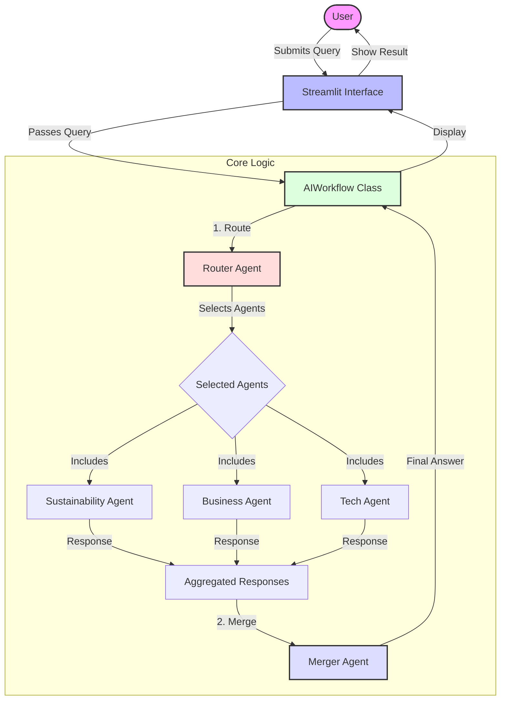

# AI Routing System Workflow

This document outlines the architectural flow of the AI Routing System.

## System Overview

The system is designed to intelligently route user queries to specialized AI agents, execute them in parallel, and merge their insights into a cohesive response.

## Flow Description

1.  **User Query**: The process begins when a user submits a query through the Streamlit interface.
2.  **AIWorkflow Orchestrator**: The `AIWorkflow` class manages the lifecycle of the request.
3.  **Router**: The `Router` analyzes the query and determines which specialized agents are best suited to handle it. It returns a list of agent IDs.
4.  **Specialized Agents**: The selected agents (Sustainability, Business, Tech) process the query independently using their specific system prompts.
5.  **Merger**: The `Merger` collects all agent responses and synthesizes them into a single, comprehensive answer.
6.  **Final Response**: The merged response is displayed to the user.

## Mermaid Diagram

